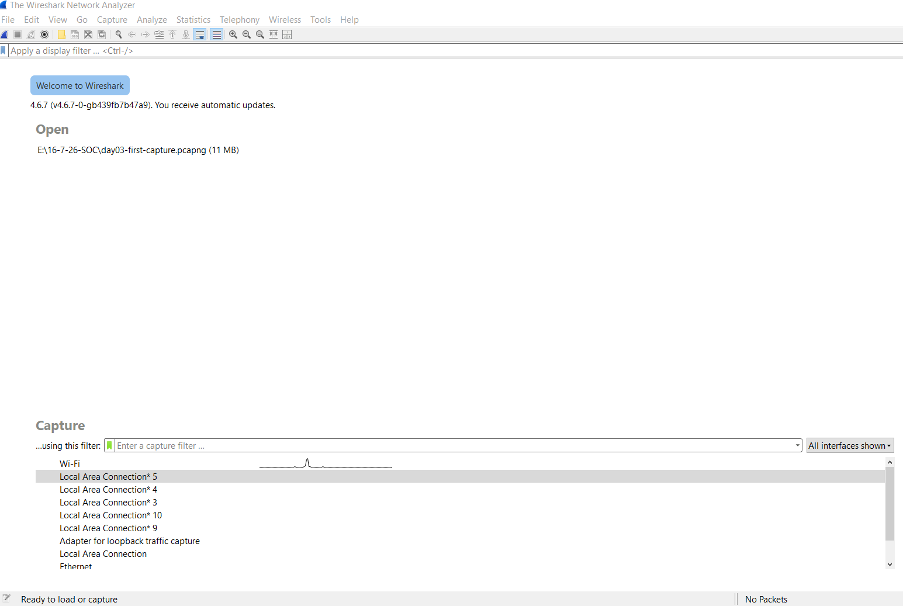
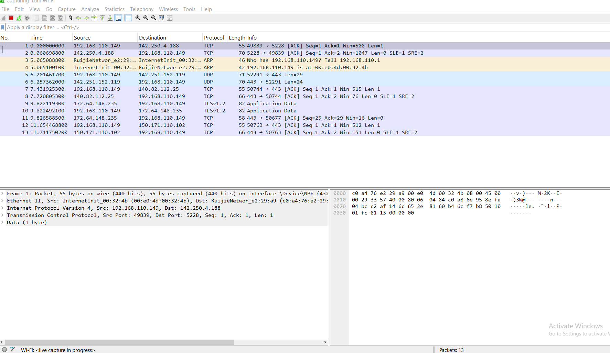
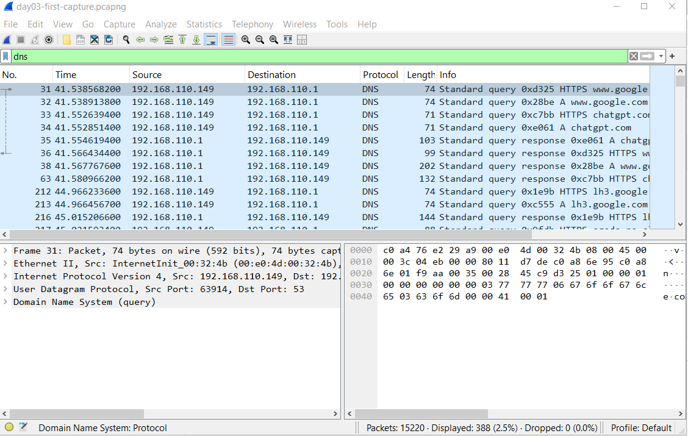
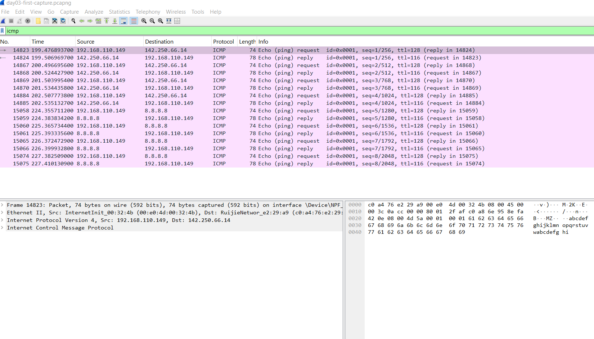
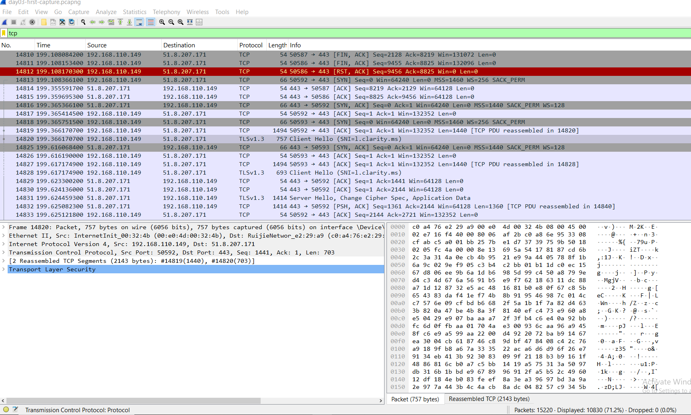
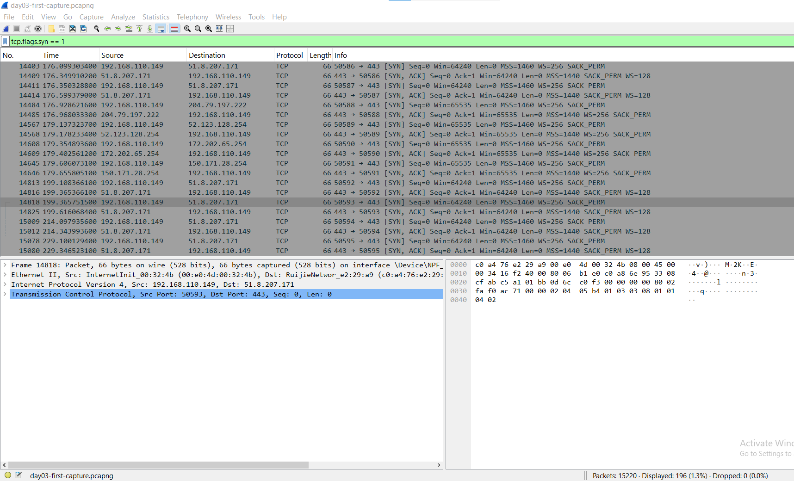
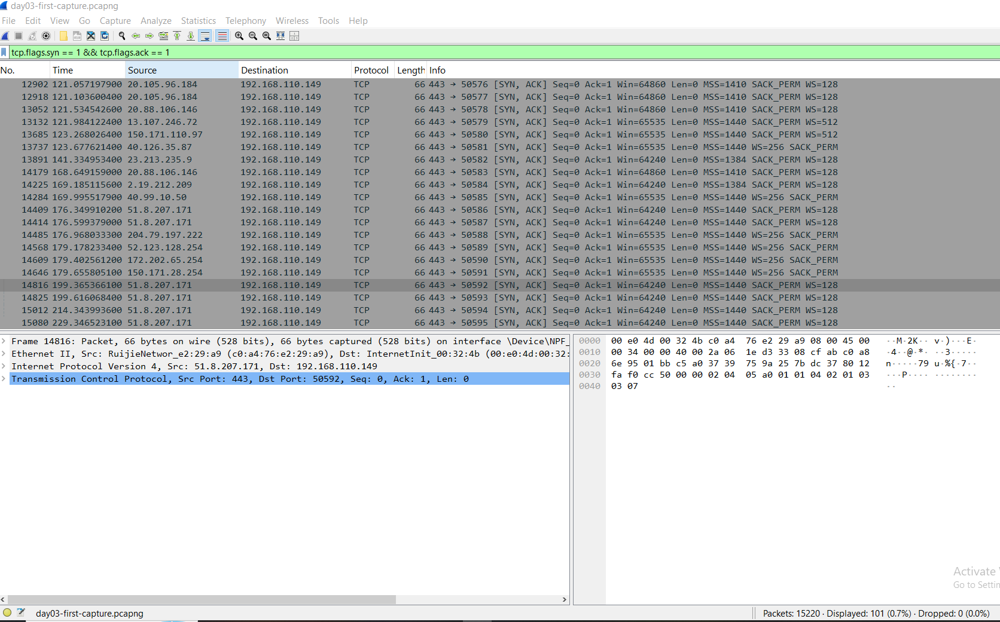
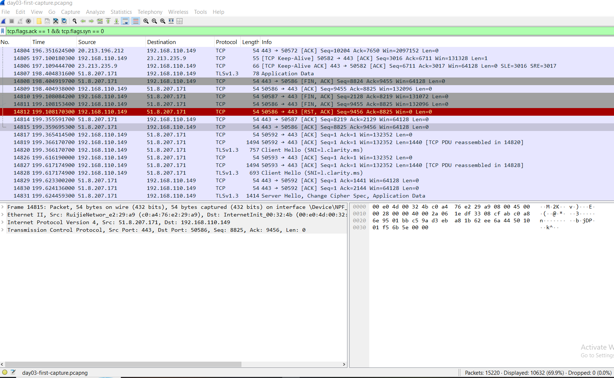
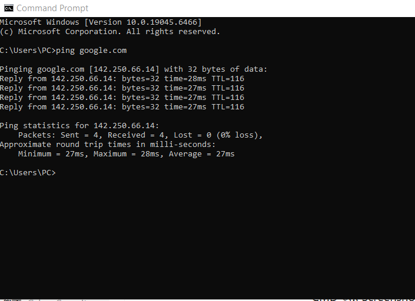
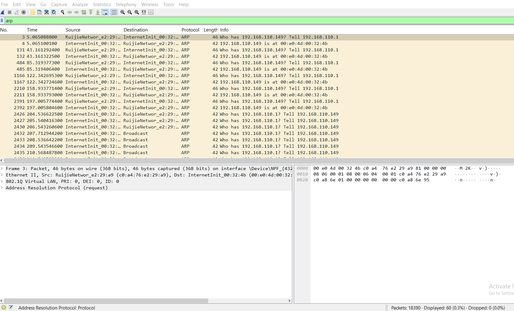

# TCP & Wireshark Fundamentals

## Objective

The goal of this lab was to understand how network communication works at the packet level by capturing and analyzing live traffic using Wireshark.

---

## Topics Covered

- TCP Three-Way Handshake
- TCP Flags
- Wireshark Installation
- Live Packet Capture
- DNS Analysis
- ICMP Analysis
- TCP Analysis
- ARP Analysis
- Wireshark Display Filters

---

## Tools Used

- Wireshark 4.6.7
- Windows 10
- Command Prompt

---

## Packet Capture

The packet capture used throughout this lab can be downloaded below.

📥 **[day03-first-capture.pcapng](captures/day03-first-capture.pcapng)**

---

## Wireshark Filters

| Filter | Purpose |
|---------|---------|
| `dns` | Display DNS packets |
| `icmp` | Display ICMP packets |
| `tcp` | Display TCP packets |
| `arp` | Display ARP packets |
| `tcp.flags.syn == 1` | SYN packets |
| `tcp.flags.syn == 1 && tcp.flags.ack == 1` | SYN-ACK packets |
| `tcp.flags.ack == 1 && tcp.flags.syn == 0` | ACK packets |

---

## Screenshots

### Wireshark Home



---

### Live Packet Capture



---

### DNS Analysis



---

### ICMP Analysis



---

### TCP Traffic



---

### TCP SYN Packets



---

### TCP SYN-ACK Packets



---

### TCP ACK Packets



---

### Ping Verification



---

### ARP Analysis



---

## What I Learned

- Captured live network traffic using Wireshark.
- Understood how the TCP Three-Way Handshake establishes a connection.
- Identified common TCP flags such as SYN, SYN-ACK, and ACK.
- Observed DNS queries and responses.
- Verified ICMP communication using the `ping` command.
- Learned how ARP resolves IP addresses to MAC addresses.
- Practiced using Wireshark display filters to inspect different network protocols.

---

## Repository Structure

```text
Day03-TCP-Wireshark-Fundamentals
│
├── README.md
├── captures
│   └── day03-first-capture.pcapng
└── screenshots
    ├── 01-wireshark-home.png
    ├── 02-live-packet-capture.png
    ├── 03-dns-filter.png
    ├── 04-icmp-filter.png
    ├── 05-tcp-filter.png
    ├── 06-tcp-syn.png
    ├── 07-tcp-syn-ack.png
    ├── 08-tcp-ack.png
    ├── 09-ping-command.png
    └── 10-arp-filter.png
```

---

## Conclusion

This lab gave me practical experience capturing and analyzing live network traffic with Wireshark. Understanding protocols such as TCP, DNS, ICMP, and ARP provides a strong foundation for packet analysis and future SOC investigations.
